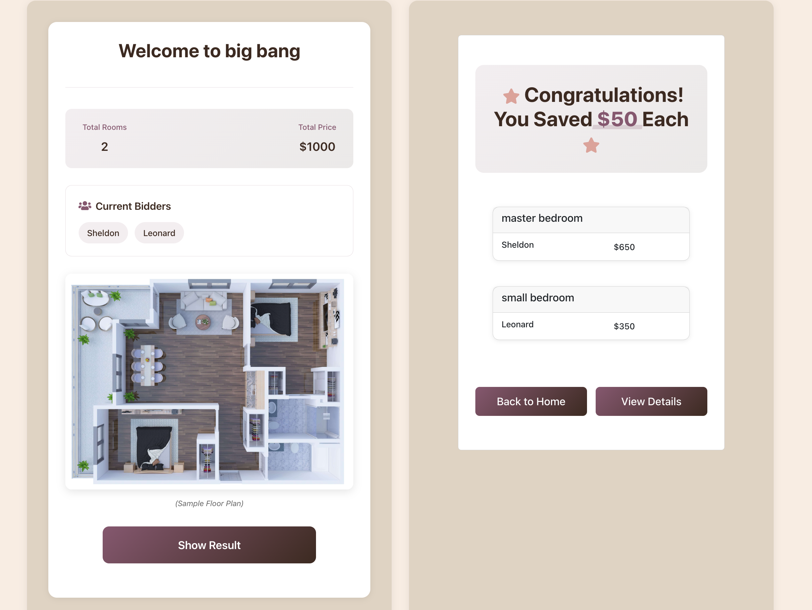
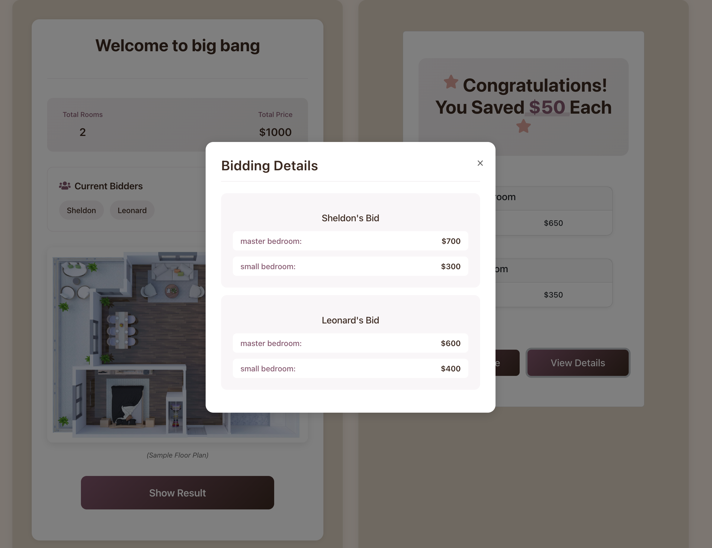

## Soommate: A Roommate Rent Distribution Application: https://mingwandowski.github.io/soommate-boot/

Soommate is a rent distribution web application based on roommates’ bids for each room.

It mainly targets small groups of friends (3–4 people) renting a shared apartment or house. With rooms varying in size and budgets differing among tenants, this tool simplifies rent allocation by allowing tenants to bid on rooms and calculating the optimal distribution.

## Build and Run

- front-end: React.js
- back-end: Spring Boot
- database: MySQL / MongoDB

1. Clone the project to your local device.
2. For the front-end part, use `npm start` to start the React server on localhost:3000 (Ensure Node.js and npm are installed.)
3. For the back-end, you can configure the data source in the file application.properties. You can choose either `db.source=mongodb` or `db.source=jpa`. For JPA, you only have to `create database soommate` in your MySQL. (Remember to change configs such as username and password for MySQL or MongoDB)

## Demo

There is a demo account for you to see how it worked.
- home name: big bang
- password: 123

Let's say **Sheldon** and **Leonard** are moving to a new apartment with a total price of $1000. Sheldon prefers the master bedroom.

Sign Up Home

Here are their bids:

| tenants | master bedroom | small bedroom |
| ------- | -------------- | ------------- |
| Sheldon | 700            | 300           |
| Leonard | 600            | 400           |

Calculate Result

And you can see the details after the calculation

