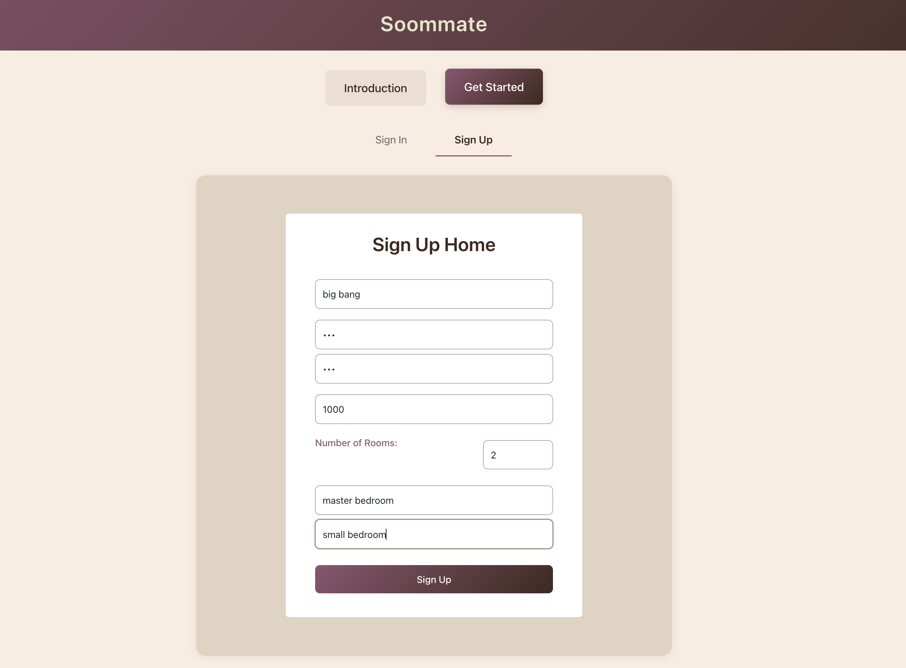
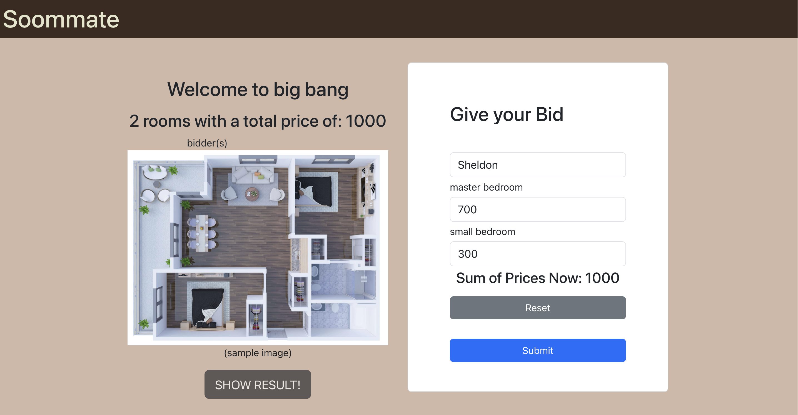
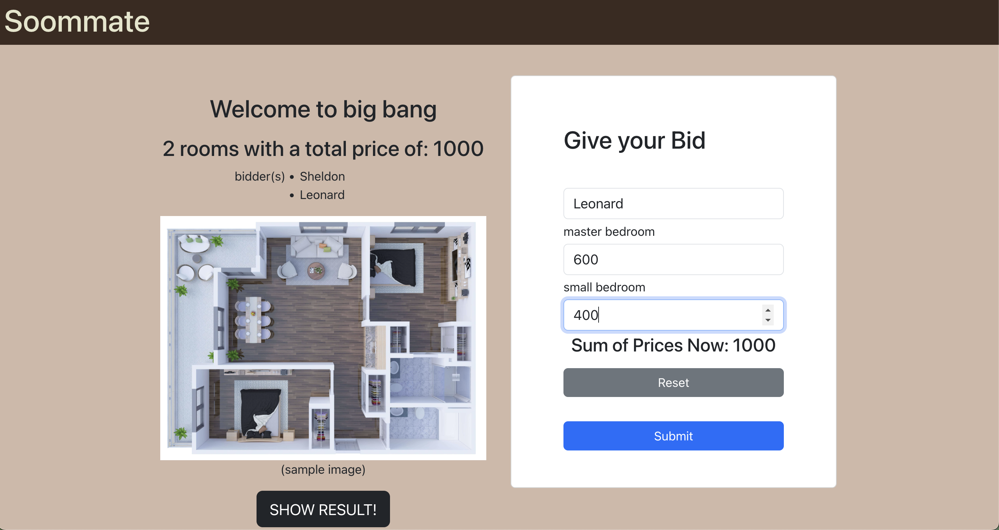
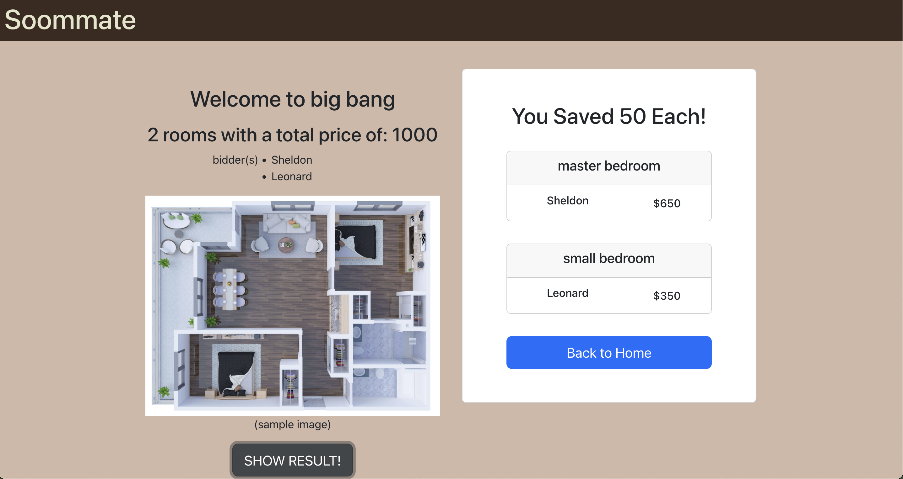

## Introduction

Soommate is a rent distribution web application based on roommates’ bids for each room.

It mainly faces such as 3 or 4 friends who would like to rent an apartment or house together. Since there are different kinds of rooms with different sizes, (maybe someone has to live in the living room) and also different people have different budgets. There is always going to be some problem with what's the price for each room and who should live in which room.

The basic idea is that you can create a "Home" with different "rooms" to be chosen. And since we have fixed the total price of the whole apartment or house, each tenant could bid on each room. In other words, they can give out the highest price they are willing to accept for each room. After all the tenants have finished their bids, it will find the best combination with the highest total amount of price and average the rest to everyone. So that everyone will be assigned a room with a price lower than their expectation.

## Build and Run

- front-end: React.js
- back-end: Spring Boot
- database: MySQL / MongoDB

1. Clone the project to your local device.
2. For the front-end part, use `npm start` to start the React server on localhost:3000 (pre-request: node, npm)
3. For the back-end, you can configure the data source in the file application.properties. You can choose either `db.source=mongodb` or `db.source=jpa`. For JPA, you only have to `create database soommate` in your MySQL. (Remember to change configs such as username and password for MySQL or MongoDB)

## Demo

There is a demo account for you to see how it worked.
- home name: big bang
- password: 123

Let's say **Sheldon** and **Leonard** are moving to a new apartment with a total price of $1000. Sheldon really wants to live in the master bedroom.

Here are their bids:

| tenants   | master bedroom | small bedroom |
|-----------|----------------|---------------|
| Sheldon   | 700            | 300           |
| Leonard   | 600            | 400           |

Sign Up Home

Sheldon Bid

Leonard Bid

Calculate Result
